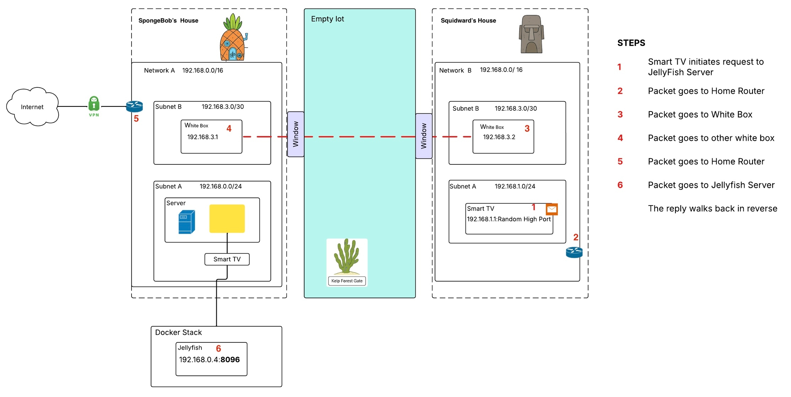

# 🧠 Networking Fundamentals Diagram – SpongeBob Edition

Welcome to my Networking Fundamentals Bootcamp diagram!  
This project explores how a Smart TV sends a request to a media server (Jellyfish Server) across networks using concepts like subnets, routers, and VPN tunnels — all visualized through Bikini Bottom. 🌊

---

## 📺 Scenario Overview

Squidward wants to stream videos on his Smart TV, but the media server (Jellyfish) lives with SpongeBob. To make this happen, we follow the journey of a network packet across two homes, using a VPN tunnel, switches, and subnet isolation.

---

## 🔄 Packet Flow Steps

1. **Smart TV initiates request** to the Jellyfish Server  
2. **Packet goes to Squidward's home router**  
3. **Packet is forwarded to a White Box** (network device)  
4. **Packet crosses to SpongeBob's White Box** via a "window" (peer connection)  
5. **Packet enters SpongeBob’s router**, where it is sent through a VPN tunnel  
6. **Packet reaches Jellyfish Server**, running in a Docker Stack  

➡️ **Reply follows the same path back, in reverse.**

---

## 🛠️ Tools Used

- 🖼️ **Lucidchart** – for diagram creation  
- 📁 **GitHub** – for version control  
- 🐳 **Docker Stack** – to simulate the Jellyfish media service  
- 🧽 **Creativity** – Because it’s more fun with SpongeBob 😄

---

## 🚧 Known Limitations & Notes

- IP range overlap (if present) may cause routing confusion at scale — this can be resolved by assigning distinct private network ranges to each home.
- “White Boxes” act as handoff or relay points; ideally, they would be replaced with clearly defined devices like Layer 3 routers or firewalls.
- VPN representation assumes a persistent tunnel exists between both homes.

---

## 🤔 Why SpongeBob?

Because learning networking doesn't have to be dry! Visual metaphors like Squidward's house, the Kelp Forest Gate, and SpongeBob's pineapple make complex topics easier to grasp.

---

