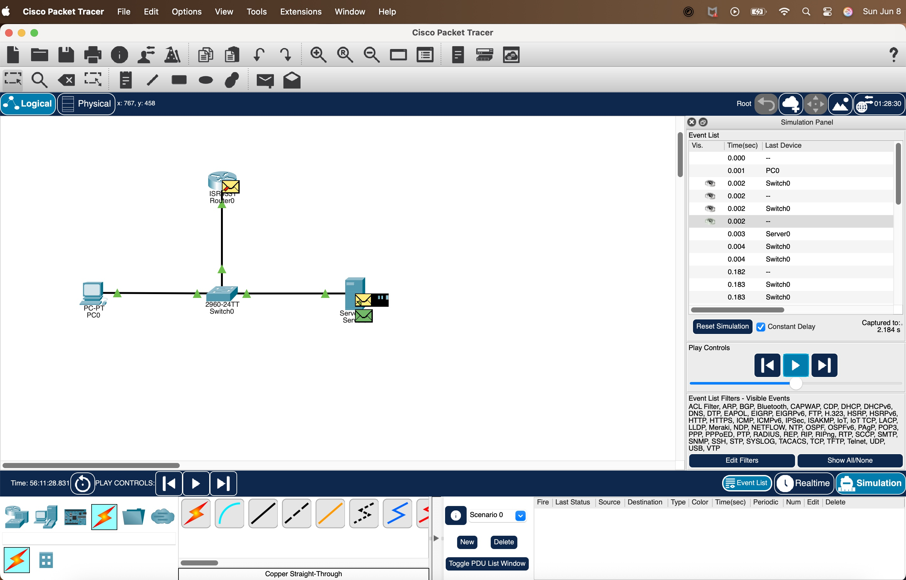

# 🧽 Bikini Bottom x Packet Tracer Lab – Beginner Networking README

Hi there! I'm Jas 🙋🏽‍♀️ and this is my beginner-friendly README for a networking lab I did using **Cisco Packet Tracer** — but with a twist: I themed it like **SpongeBob** because why not make learning fun?

This doc walks through how I built a mini Bikini Bottom network, learned about how devices get IP addresses, and watched packets move like jellyfish drifting through town. 🐚

---

## 🌊 Lab Overview

**Goal:** To understand how a PC (SpongeBob) gets an IP address using DHCP (from Squidward the Server) and how it communicates across the network.

**What I Used:**

- 1 PC (SpongeBob)
- 1 Server (Squidward)
- 1 Switch (Goo Lagoon Lifeguard Tower)
- 1 Router (Krusty Krab)
- Copper straight-through cables

---

## 🔌 Step-by-Step Bikini Bottom Network Setup

### 🧃 Step 1: Connect Everyone
We connected:

- SpongeBob's PC → Switch
- Squidward's Server → Switch
- Switch → Krusty Krab Router

All using Ethernet cables (straight-through). This is like plugging everyone into jellyfish fields so they can yell at each other. 🪸

### 🧠 Step 2: Configure the Router (Krusty Krab)
We gave the router an IP address using the CLI:

```bash
Router> enable
Router# config t
Router(config)# interface gig0/0/0
Router(config-if)# ip address 192.168.0.1 255.255.255.0
Router(config-if)# no shutdown
```

Now the router has its own address and is "awake" to route things!

### 📦 Step 3: Set Up Squidward the Server
We gave the server a **static IP**:

- IP: `192.168.0.100`
- Subnet Mask: `255.255.255.0`
- Default Gateway: `192.168.0.1`

This makes sure the server knows where to go (through the router) when it wants to send something out of Bikini Bottom.

### 🔧 Step 4: Turn on the DHCP Service
Inside the server’s Services tab, we turned on DHCP and made a pool:

- Default Gateway: `192.168.0.1`
- DNS Server: `192.168.0.1`
- Start IP: `192.168.0.101`
- Subnet Mask: `255.255.255.0`
- Max Users: 100

Squidward is now ready to assign addresses to anyone who asks nicely.

### 📣 Step 5: SpongeBob Asks for an IP (Discover)
We used the PC’s terminal:

```bash
ipconfig /renew
```

This is SpongeBob yelling:

> "I just moved in! Anyone got a free house number (IP) for me?"

The PC sends a **DHCP Discover** message — a broadcast across the network.

### 🔎 Step 6: Watch the Packet Flow
In simulation mode:

- The PC sends the request → Switch
- The Switch floods the request → Router and Server
- The Router drops it ❌ (not a DHCP server)
- The Server catches it ✅ and replies

### 📬 Step 7–10: DORA Happens (Discover → Offer → Request → Acknowledge)
1. **Offer:** Server says: "I’ve got 192.168.0.101, want it?"
2. **Request:** PC says: "Yes please!"
3. **Acknowledge:** Server says: "Done. That’s your IP now."

The full DORA process is done — SpongeBob now has his own house number in Bikini Bottom! 🎉

### 🪞 Step 11: Gratuitous ARP ("This Is My Address Now")
The PC sends out a message:

> “Hey everyone, just letting y’all know — I live at 192.168.0.101 now.”

This helps update everyone’s ARP tables. Think of it like putting a mailbox out front.

---

## 🖼️ State of the Network (Simple Breakdown from My Lab)

While exploring Packet Tracer, I simulated a basic network where SpongeBob’s PC is trying to get an IP address from Squidward the Server using DHCP. This snapshot (shown below) is part of my homework and shows what’s happening right now in the network. From my understanding based on the lab, here’s what’s going on step by step:



- 🟢 All cables are connected and working — the green triangles mean the devices are powered on and talking to each other.
- 💻 SpongeBob’s PC sends out a DHCP Discover message to ask for an IP.
- 📦 The switch receives and broadcasts that packet across the network.
- ❌ The router drops the packet because it’s not listening on UDP port 67 (not a DHCP server).
- ✅ The server is listening on UDP port 67 and catches the message. It replies with an IP offer.
- 🔄 A DORA process happens (Discover, Offer, Request, Acknowledge), giving SpongeBob an IP.
- 📢 The PC then sends a Gratuitous ARP to say “This is my IP now!” to everyone on the network.
- 🧠 Meanwhile, an ARP request may also happen to figure out who the default gateway (router) is.

This explains the snapshot and how DHCP and ARP work in the background.

---

## 📘 My Understanding of Key Networking Concepts (SpongeBob Style)

I'm not new to networking, but some concepts I forget. So here's how I think about them using SpongeBob analogies — if I’m off, feel free to correct me!

### 🧠 What is DHCP?
DHCP is like a friendly receptionist in Bikini Bottom (Squidward, lol) who assigns house numbers (IP addresses) to new residents (like SpongeBob's PC). Instead of us manually typing in numbers, Squidward handles it for everyone.

DHCP = **Dynamic Host Configuration Protocol**. It hands out IPs and tells devices their gateway and DNS info.

### 🔄 What is DORA?
This is how IP addresses get assigned using DHCP:

1. **Discover** – SpongeBob shouts: “Is there any free table?”
2. **Offer** – Squidward replies: “Here’s one!”
3. **Request** – SpongeBob says: “I want that one.”
4. **Acknowledge** – Squidward confirms: “It’s yours.”

This back-and-forth is how a device gets its IP.

### 📣 What is ARP?
ARP = **Address Resolution Protocol**. After knowing someone’s IP, you still need their house’s actual physical address (MAC address). ARP is like shouting in Jellyfish Fields: “Who lives at 192.168.0.1?” and someone replies, “Me!” with their MAC info.

---

## 🧽 Final Thoughts

This lab helped me understand how devices talk on a network and how they get their IPs without manual setup. Using SpongeBob made it more fun and way easier to remember.

If you're brushing up on networking like I am, I highly recommend Packet Tracer. Mistakes are part of the fun — even SpongeBob has to try twice sometimes. 💛