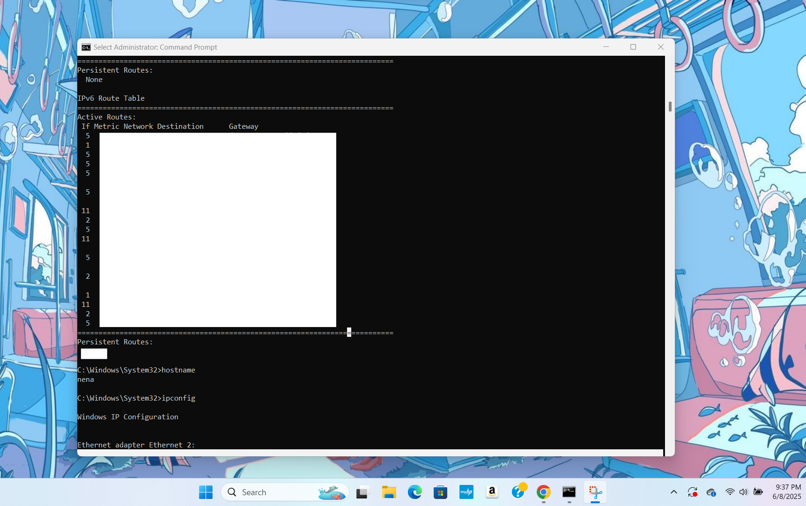

# 🌟 Networking Lab Journal - SpongeBob Edition
> “I'm ready! I'm ready! I'm ready... to debug my network!” — SpongeBob SquareShell 😎

## Developer Environment
**Environment Used:** Windows 11 (Local Machine, not a cloud server)  
**Tool:** Command Prompt run as Administrator  
**Screenshot:** 





> ⛰️ This environment is fully local. All tools were run from my local computer. Hostname is redacted for security purposes.

---

## 📀 IPConfig
```bash
C:\Windows\System32>ipconfig

Ethernet adapter Ethernet 2:
   Link-local IPv6 Address . . . . . : fe80::xxxx:xxxx:xxxx:xxxx%11
   IPv4 Address. . . . . . . . . . . : 192.168.56.1
   Subnet Mask . . . . . . . . . . . : 255.255.255.0
   Default Gateway . . . . . . . . . :
```
✨ This shows the local IP configuration of my machine. IPv4 is from a VirtualBox network adapter, confirming it's local only.

---

## 🧼 Flush DNS
```bash
C:\Windows\System32>ipconfig /flushdns

Successfully flushed the DNS Resolver Cache.
```
🧽 Clears DNS cache like cleaning up dirty Krabby Patties.

---

## 📡 Ping
```bash
C:\Windows\System32>ping -t www.google.com
Reply from 2607:xxxx:xxxx::6a: time=14ms
Request timed out.
Reply from 2607:xxxx:xxxx::6a: time=132ms

Ping statistics:
    Sent = 21, Received = 20, Lost = 1 (4% loss)
```
🎯 This checks if Google is reachable. One packet was lost—maybe Plankton intercepted it.

```bash
C:\Windows\System32>ping -4 www.google.com
Pinging www.google.com [142.xxx.xxx.xxx]:
Reply from 142.xxx.xxx.xxx: time=14ms
```
📬 Forces IPv4 ping to avoid SpongeBob confusion with IPv6 jellyfish.

```bash
C:\Windows\System32>ping -a 142.xxx.xxx.xxx
Pinging yq-in-f103.1e100.net [142.xxx.xxx.xxx]:
Reply from 142.xxx.xxx.xxx: time=14ms
```
🔍 Shows the domain name linked to an IP address. SpongeBob finds the name behind the numbers.

```bash
C:\Windows\System32>ping -f -l 1800 www.google.com
Packet needs to be fragmented but DF set.
```
📦 Checks max packet size before Krusty Krab’s data fragments mid-delivery.

---

## 🔁 Trace Route
```bash
C:\Windows\System32>tracert -4 www.google.com
Tracing route to www.google.com [74.xxx.xxx.xxx]:
  1    <1 ms  192.168.0.1
  2    15 ms  [ISP node]
  ...
```
🚦 Traces how packets hop across networks to reach their destination—like Patrick trying to find the bathroom.

---

## 📊 Netstat
```bash
C:\Windows\System32>netstat -b

Active Connections

  Proto  Local Address          Foreign Address        State
  TCP    127.0.0.1:49693        localhost:49694        ESTABLISHED
 [WUDFHost.exe]
  TCP    127.0.0.1:49694        localhost:49693        ESTABLISHED
 [WUDFHost.exe]
  TCP    127.0.0.1:49741        localhost:49742        ESTABLISHED
 [ipfsvc.exe]
  TCP    127.0.0.1:49742        localhost:49741        ESTABLISHED
 [ipfsvc.exe]
  TCP    192.168.0.19:50091     172.xxx.xxx.xxx:https   ESTABLISHED
 [svchost.exe]
  TCP    192.168.0.19:52001     52.xxx.xxx.xxx:https    ESTABLISHED
 [ms-teams.exe]
```
🕵️‍♂️ Shows all open connections and what processes are using them—MS Teams was surfing the net!

---

## 🔎 NSLookup
```bash
> www.cnn.com
Server:  [DNS Server]
Address: [IP Address]

Non-authoritative answer:
Name:    cnn-tls.map.fastly.net
Addresses: 151.101.65.5
```
📇 Converts human-friendly names to IP addresses—like Krabs converting coupons to Krabby Patty combos.

```bash
> www.nena56.com
*** can't find www.nena56.com: Non-existent domain
```
❌ That domain doesn’t exist—maybe Squidward typed it wrong.

---

## 🚗 Route Print
```bash
C:\Windows\System32>route print

IPv4 Route Table
===========================================================================
Network Destination    Netmask              Gateway          Interface       Metric
0.0.0.0               0.0.0.0              192.168.0.1      192.168.0.19    50
127.0.0.0             255.0.0.0            On-link          127.0.0.1       331
127.0.0.1             255.255.255.255      On-link          127.0.0.1       331
192.168.56.0          255.255.255.0        On-link          192.168.56.1    281
224.0.0.0             240.0.0.0            On-link          127.0.0.1       331
255.255.255.255       255.255.255.255      On-link          127.0.0.1       331
```
🗺️ This table shows how packets choose their path through networks. Default route (`0.0.0.0`) goes through the gateway.

```bash
IPv6 Route Table
===========================================================================
If Metric Network Destination        Gateway
5    306   ::/0                     fe80::3e37:xxxx:xxxx
1    331   ::1/128                  On-link
5    306   fe80::d7f4:xxxx/128     On-link
1    331   ff00::/8                On-link
```
🚦 These are the highway signs for IPv6 packets. `::1` is localhost, and `::/0` is the default route.

---

## 🖥️ Hostname (Proof of Local Machine)
```bash
C:\Windows\System32>hostname
(local hostname redacted)
```
🔐 Shows I ran these commands from my local Windows machine. Hostname is retracted for privacy and security.

---

> 🍍 ** Final Thought:** All networking commands were executed locally. Each tool gave insight into how my system communicates with the internet, just like how SpongeBob communicates with jellyfish… enthusiastically and with occasional glitches!
